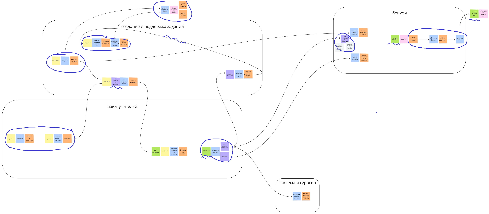
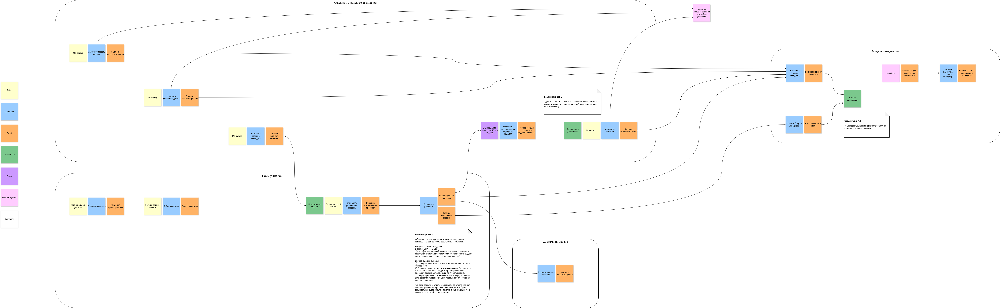

# Домашка 1 недели

## Задание

1. Прошлые разработчики системы уже подготовили EventStorming модель. Вам необходимо изучить модель и найти все места, которые либо сделаны не корректно, либо которые можно улучшить. Сделайте исправленную версию EventStorming, отметьте на значальном EventStorming и объясните все места, где прошлые разработчики допустили ошибки.

    - Подсказка: таких мест 12

2. Напишите как назвали бы 4 реализованные коммуникации в коде по исправленному EventStroming. Для этого выберете любые 2 команды и события связанные с ними и заполните таблицу ниже. По итогу у вас должно получиться два названия для каждого выбранного события и связанного с ним команды (по одному для синхронной и асинхронной связи):

    | Вид связи | Название команды или события из ES | Название эндпоинта или название события в коде |
    | --------- | ---------------------------------- | ---------------------------------------------- |
    | Синхронная HTTP | Event или command из EventStorming 1 | `/api/something` |
    | Синхронная HTTP | Event или command из EventStorming 2 | `/api/something` |
    | Асинхронная event-driven | Event или command из EventStorming 1 | `SomethingEvent` |
    | Асинхронная event-driven | Event или command из EventStorming 2 | `SomethingEvent` |

3. Необходимо написать что не так с уже готовыми событиями:

    - `[EVENT-010]`  
    {
      "event_name": "TaskRating",
      "value": "completed"
    }

    - `[EVENT-020]`  
    {
      "event_name": "Task",
      "payload": {
        "id": 1,
        "rating": "0.04",
        "name": "...",
        "description": "...",
        "author": {
          "id": 1,
          "name": "Pavel",
          "email": "...",
          "role": "manager",
          "created_at": "...",
        }
        "attempt_count": "",
        "answers": [
          {
            "id": 1,
            "text": "...",
            "status":
            "author": {
              "id": 2,
              "name": "Nick",
              "email": "...",
              "role": "maybe_teacher",
              "created_at": "...",
            }
          },
          ...
        ],
        "created_at": "...",
      }
    }

    - `[EVENT-030]`  
    {
      "event_name": "CalculateTaskRating",
      "payload": {
        "id": 1,
        ...
       }
    }

4. Опишите, как изменятся связи из текущей системы (найдете в общем условии) и после реализации корректного EventStorming. Какие из проблем бизнеса решатся (из описанных в списке выше) и почему вы решили изменить существующую связь. Чтобы было проще, возьмите шаблон таблицы.

    | Номер связи | Как связь сделана на текущий момент | Какая теперь будет связь | Номера проблем бизнеса, которые потенциально решатся | Почему связь необходимо изменить |
    | -- | -- | -- | -- | -- |
    | **[COMM-XXX]** | | | | |
    | **[COMM-XXX]** | | | | |

5. Бизнес решил в будущем улучшить систему, добавив чат (работы планируются в следующем году, сейчас только обсуждается решение). Чат должен быть между менеджером и кандидатами в учителя. Задержки в отправке сообщений не критичны, но каждый кандидат может общаться с разными менеджерами и наоборот. В случае менеджеров ситуация аналогичная и должна поддерживаться только one-to-one коммуникация в чате. Т.е. делать его придется асинхронно.  
Когда фича обговаривалась с прошлыми разработчиками, они сказали, что тут необходима kafka как message broker, другие варианты не подойдут.  
Попробуйте предположить на сколько корректная оценка выбора брокера была со стороны разработчиков и объясните, почему это решение либо ок, либо не ок.

## Решение

### 1. Исправление EventStorming

Ошибки:

1. Нарушение временной линии

    - событие **"Потенциальный учитель зарегистрировался"** на схеме позже чем событие **"Потенциальный учитель залогинился"**.
      Нужно поменять местами группы стикеров.
    - Стрелка назад от события **"Менеджер для переделки назначен"** до команд **"Выбрать задание"** и **"Обновить условие задания"**.
      Стрелки назад быть не должно.

2. Использование read model не по назначению

    - read model **"Выполненное задание"** у команды **"Проверить решение"** - read model должна стоять у актора (здесь его нет).
    - read model **"если баланс положительный"** у внешней системы **"шедулер"** - у внешней системы не указывается read model.
      Больше похоже на часть внутренней логики, ее лучше представить в виде стикера с комментарием.
    - read model **"количество денег на оплату"** у внешней системы **"платформа для перевода денег"** - у внешней системы нет read model (она должна быть у актора).
      Здесь мне вообще кажется что указывать внешнюю систему избыточно.

3. Использование policy не по назначению

    - policy **"если задание не назначено"** - это не policy, а деталь имплементации команды (причем излишняя).
      Как я понимаю, для акторов policy быть не может, актор должен принимать решение о запуске команды на основе read model.
      Поэтому в ES такой порядок стикеров в принципе недопустим.
      Лучше вообще убрать, либо указать комментарием.
    - policy **"если задание правильное"** и **"если задание неправильное"** - это должны быть события.
    - policy **"если прошлый рейтинг ок"** - деталь имплементации (и скорее всего неверная), не является условием по запуску или не запуску бизнес-команды.
      Лучше вообще убрать, либо указать комментарием.

4. Вместо поведения описывается реализация

    - Цепочка команд **"Выбрать задание по ID"** и **"Сделать update в базу нового условия задания"**.
      Неверная последовательность для ES, команда должна порождать событие, а событие может триггерить новую бизнес-команду.
      Технический нейминг в командах.
      Вместо одного события "Задание отредактировано" - добавлен технический шаг.

    - Цепочка команд **"Обнулить баланс"** и **"Выполнить оплату"**.
      Это тоже технические шаги, на ES этого быть не должно.

5. Технические события для командной коммуникации

    - Группа стикеров **"Менеджер"** **"Зарегистрировал задание"** и событие **"Изменить задание"**.
      Непонятно, что хотел сказать автор - команда не соответствует событию.
      Но вообще нейминг события "Изменить задание" - выглядит как командная коммуникация.
      Событие должно отвечать на вопрос "что произошло" - глагол в прошедшем времени.

6. Разные языки (программистский нейминг вместо бизнесового)

    - Команды **"Выбрать задание по ID"** и **"Сделать update в базу нового условия задания"** - программистский нейминг.
      Вместо этого должна быть команда бизнеса.

7. Схлопнувшиеся события

    - Потенциально, команда **"проверить решение"** по-хорошему должна быть разделена на две, каждая со своим событием в качестве результата (но я не уверен, что это явная ошибка в данном примере).

Исправленная версия:

### 2. Названия HTTP вызовов и событий

| Вид связи | Название команды или события из ES | Название эндпоинта или название события в коде |
| --------- | ---------------------------------- | ---------------------------------------------- |
| Синхронная HTTP | Назначить задание кандидату | `/api/assignNewTask` |
| Синхронная HTTP | Отправить решение на проверку | `/api/submitSolution` |
| Асинхронная event-driven | Назначить задание кандидату | `TaskAssigned` |
| Асинхронная event-driven | Отправить решение на проверку | `SolutionSubmitted` |

### 3. Что не так с событиями

1. `[EVENT-010]`  
  Событие слишком мелкое (fine):
    - Оно говорит только о том, что какой-то код отработал (грубо говоря, не упал).
    - При этом не сообщает результат расчета, а также для какой задачи этот рейтинг был расчитан.

2. `[EVENT-020]`  
  Наоборот, слишком большое событие (coarse):
    - Помимо данных, присущих самому объекту `Task`, оно сообщает также:
        - Кто его создал;
        - Сколько раз на него отвечали;
        - Кто и как на него отвечал (с ответами).  

    Как я понимаю, это плохо, потому что раскрывает детали реализации других модулей:  
    я думаю, знать кто автор задания еще не так плохо (как минимум, это данные из одного модуля), но данные о том, кто и как отвечал - лишние (это логика другого поддомена).

3. `[EVENT-030]`  
  Это "командное" событие - т.е. оно не говорит о том, что произошло, а указывает другому модулю, что ему нужно делать.
  Таким образом повышается coupling между разными частями системы.

### 4. Как изменятся коммуникации

| Номер связи | Как связь сделана на текущий момент | Какая теперь будет связь | Номера проблем бизнеса, которые потенциально решатся | Почему связь необходимо изменить |
| -- | -- | -- | -- | -- |
| **[COMM-010]** | Синхронный HTTP-вызов | Часть пейлоада события _"TaskAssigned"_ | **[Problem-010]** | Чтобы уменьшить общее число вызовов между сервисами (снизить нагрузку). |
| **[COMM-020]** | Синхронный HTTP-вызов | Синхронный HTTP-вызов | **[Problem-020]**, **[Problem-021]** | (Пока) решил **не менять** - иначе кандидат не узнает, что его задание на самом деле было обновлено. |
| **[COMM-030]** | Синхронный HTTP-вызов | Асинхронное событие _"TaskSolved"_ | **[Problem-090]** | Замена "командного" взаимодействия на событийное - уменьшает coupling. |
| **[COMM-040]** | Синхронный HTTP-вызов | Асинхронное событие _"TaskSolved"_ | **[Problem-070]**, **[Problem-090]** | Замена "командного" взаимодействия на событийное - уменьшает coupling. |
| **[COMM-050]** | Синхронный HTTP-вызов | Асинхронное событие _"TaskFailed"_ | **[Problem-090]** | Замена "командного" взаимодействия на событийное - уменьшает coupling. |
| **[COMM-060]** | Асинхронная отправка сообщения | Синхронный HTTP-вызов из сервиса Бонусов в сервис Найма | **[Problem-030]** | Чтобы в момент начисления бонуса узнать наиболее актуальный рейтинг задания. |
| **[COMM-070]** | Синхронный HTTP-вызов | Часть пейлоада события _"TaskPublished"_ или _"TaskUpdated"_ | **[Problem-050]** | Чтобы уменьшить общее число вызовов между сервисами (снизить нагрузку). |
| **[COMM-080]** | Синхронный HTTP-вызов | Асинхронное событие _"TaskPublished"_ или _"TaskUpdated"_ | **[Problem-090]** | Замена "командного" взаимодействия на событийное - уменьшает coupling. |
| **[COMM-090]** | Синхронный HTTP-вызов | Асинхронное событие _"TeacherCandidateRegistered"_ | **[Problem-040]**, **[Problem-050]**, **[Problem-060]** | Снизить нагрузку и избежать выполнения тяжелых запросов в БД, т.к. кандидатов очень много - улучшится перформанс. |

Судя по модели Event Storming, мне теперь кажется неясным, для чего нужна в принципе связь **[COMM-010]**:  
как будто бы для самого процесса решения задач, кандидатам в учителя не нужна информация о менеджерах, которые эту задачу создали или меняли.  
Даже если для чего-то эта информация окажется нужной, ее можно получить внутри события _"TaskAssigned"_ - в нем можно получить информацию, кто создавал или менял последним это задание.

Похожая ситуация со связью **[COMM-070]**: даже если для зачисления бонусов надо узнать информацию о менеджере (например, домашний адрес) - сервис Бонусов сможет эту информацию получить из двух событий: _"TaskPublished/TaskUpdated"_ (кто последний автор) + _"TaskSolved"_ (чье задание решили).

Вообще говоря, проблему **[Problem-050]** я для себя формулирую примрено так - когда один из сервисов обращается в сервис Менеджмента за данными о менеджерах, а тот в это время пошел с запросами в сервис Найма за информацией о новых кандидатах, то т.к. кандидатов много - эти запросы висят, потоки выполнения заблокированы, и могут упасть с таймаутами или закончившимися коннекшенами.  
Поэтому все коммуникации которые помогают снизить общее число запросов к нагруженному сервису - тоже (потенциально) помогают митигировать эту проблему.

### 5. Выбор брокера сообщений

Я думаю, что это всегда будет trade-off.

Чеклист, нужна ли в проекте Kafka:

- _Нужно ли получать события батчем?_  
  - Не уверен, но кажется, что нет.
- _Ожидается ли высокая нагрузка?_  
  - Настолько высокая, что не справится очередь - думаю, что нет.
- _Нужно ли читать одни и те же события в разных консьюмерах и как часто._  
  - Скорее да - т.к. много кандидатов в учителя могут общаться с разными менеджерами, и могут подключаться новые кандидаты.
- _Консьюмеру нужны все (или 80%) событий которые попадают в очередь / топик?_
  - Мне кажется это всё решается тем, как настроить топики.
  - Также это зависит от того, нужно ли новому кандидату видеть всю историю сообщений в прошлом.
- _Достаточно ли денег и компетенций в компании?_
  - `¯\_(ツ)_/¯`

Ответов "да" мало - скорее всего, Kafka не оправдает вложения средств.  
Но мне кажется, что вопрос про компетенции решает - если все умеют правильно готовить Кафку, то почему нет.  
Также, если бизнес скажет, что надо новому консьюмеру показывать сообщения от начала времён - простой очередью будет сложно это решить.

Из недостатков очередей:

- Разным консьюмерам будут нужны одни и те же сообщения - надо уметь настраивать Exchange, при этом надо учесть ситуацию когда добавляется новый консьюмер (появляется новый кандидат).
