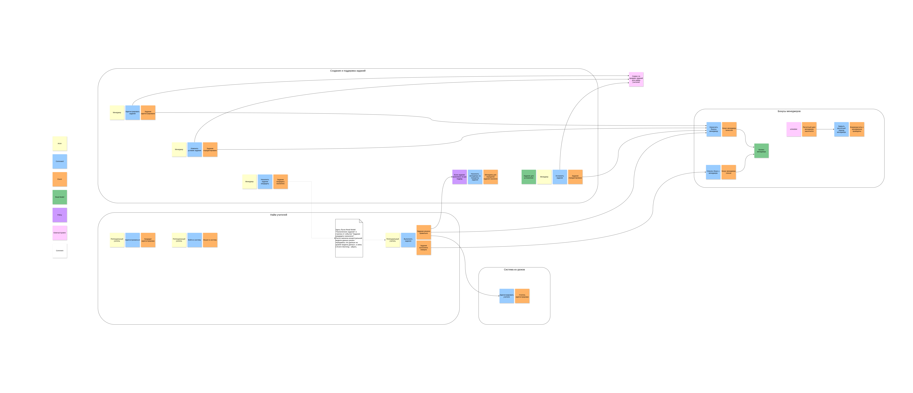
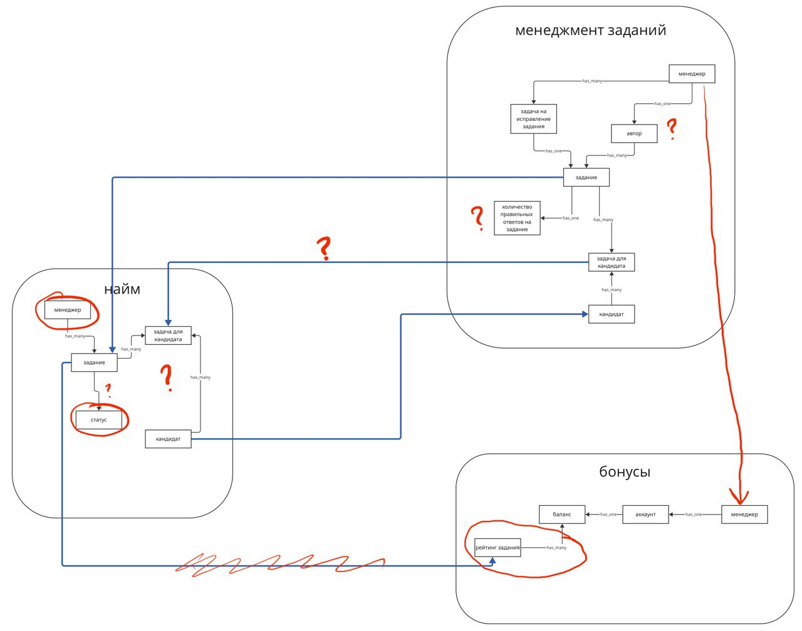
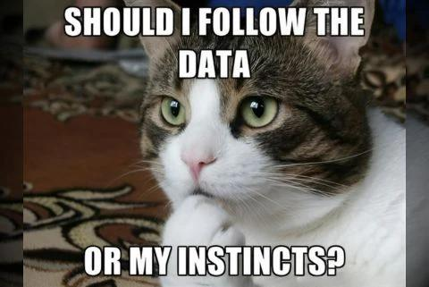
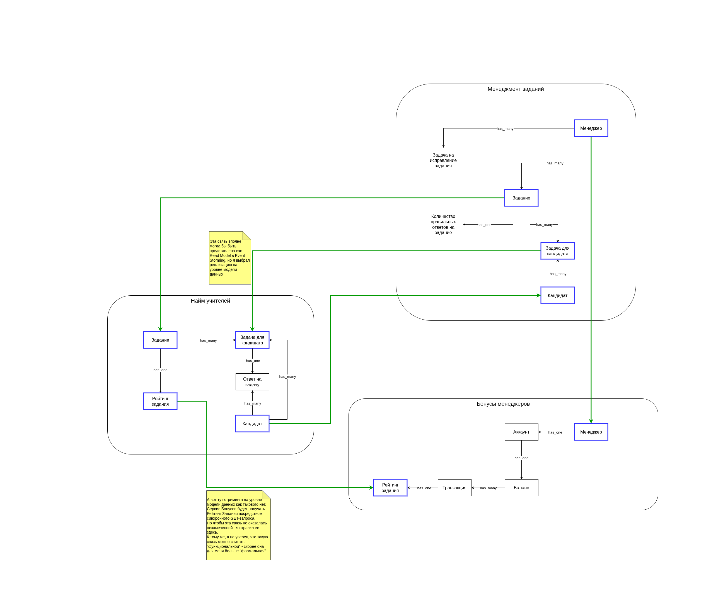
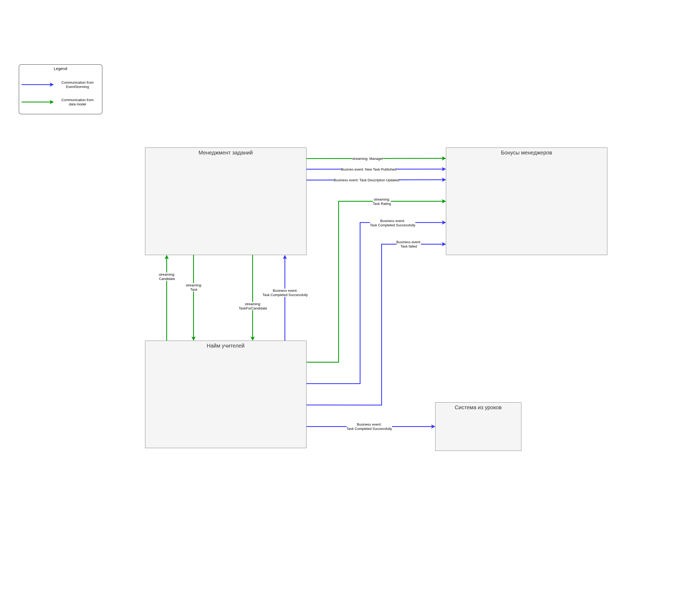
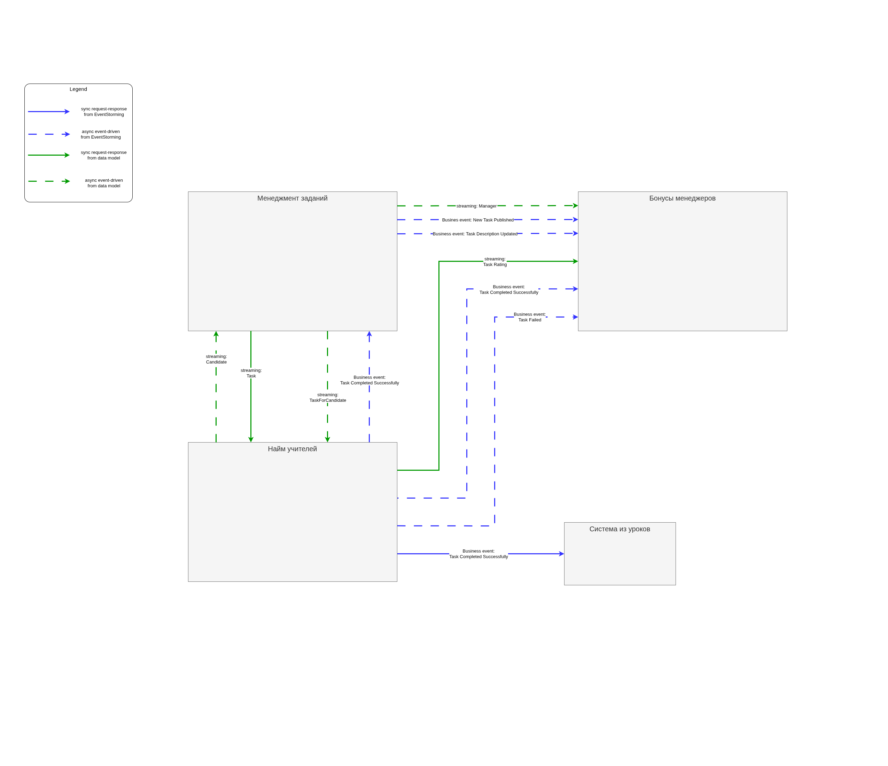

# Домашка 2 недели

## Задание

1. Прошлые разработчики системы, кроме EventStorming модели, также сделали и концептуальную модель данных. Вам опять придется изучить модель и найти все места, которые либо сделаны не корректно, либо которые можно улучшить.  
Сделайте исправленную версию концептуальной модели данных, отметьте на изначальном варианте модели данных и объясните все места, где прошлые разработчики допустили ошибки.

    - Подсказка: таких мест 5

2. По аналогии с прошлой неделей, сделайте описание синхронной и асинхронной комуникации для двух любых выбранных сущностей из концептуальной модели данных

    | Вид связи | Название сущности из концептуальной модели данных | Название эндпоинта или название события в коде |
    | --------- | ---------------------------------- | ---------------------------------------------- |
    | Синхронная HTTP | Something1 | `/api/something` |
    | Синхронная HTTP | Something2 | `/api/something` |
    | Асинхронная event-driven | Something1 | `SomethingEvent` |
    | Асинхронная event-driven | Something2 | `SomethingEvent` |

3. Сделайте общую модель формальных и функциональных связей. Как это было сделано в уроке

4. Предположите, какой вид консистентности (согласованности) нужен для каждого из видов связей который реализован на текущий момент. Достаточно написать список вот в таком виде:

    - **[COMM-XXX]** — strong consistency
    - **[COMM-XXX]** — eventual consistency

5. Найдите места, в которых нужно поменять связи с синхронных на асинхронные. Пока ничего менять не нужно, этим займётесь в следующем уроке.

6. Опишите, как после этого изменятся связи. Какие из проблем бизнеса решатся (из описанных в списке выше) и почему вы решили изменить существующую связь. Чтобы было проще, возьмите шаблон таблицы.

    | Номер связи | Как связь сделана на текущий момент | Как изменилась связь после 1 урока | Какая теперь будет связь после 2 урока | Номера проблем бизнеса, которые потенциально решатся | Почему связь необходимо изменить |
    | -- | -- | -- | -- | -- | -- |
    | **[COMM-XXX]** | | | | | |
    | **[COMM-XXX]** | | | | | |

7. Напишите название всех топиков и события, которые будут в топиках

    | Название очереди / топика | Названия событий и номеров связи, которые окажутся в топике | Почему вы поместили в топик именно эти события | Почему так назвали |
    | -- | -- | -- | -- |
    | `topic_name` | - Событие `Event` (`[COMM-XXX]`) | | |
    | | | | |

8. Покажите данные, которые можно передать либо через read model, либо через модель данных. Объясните почему выбрали один из двух вариантов.

## Решение

Дорогой читатель,

### 1. Концептуальная модель данных

#### Для начала, Event Storming  

#### Места, которые мне показались подозрительными (отмечены на рисунке)

- В элементе `"Менеджмент заданий"`:

  - Сущность `"Автор"` - неясно назначение:  

    Вроде бы это похоже на разделение ответственности между сущностями: `"Менеджер"` отвечает за AuthZ, а `"Автор"` - за бизнесовую часть (тот кто непосредственно создает и/или редактирует задания).  
    Но если это так - не логичее ли было бы привязать сущность `"Задача на исправление задания"` тоже к `"Автору"`, а не напрямую к `"Менеджеру"`?  
    Если оставить ровно в том виде, как оно нарисовано сейчас - как будто лишняя сущность.  

    Но я не уверен что это прям ошибка. В своей схеме - убрал.

  - Сущность `"Количество правильных ответов на задание"`

    Я ее воспринимаю как счетчик.  
    Из контекста `"Найм"` летит событие - _"Задание выполнено правильно"_.  
    Это событие ловит контекст `"Менеджмента заданий"` и обновляет счетчик.  
    Если после этого прилетит событие _"Задание провалено"_ - счетчик обнуляется.  
    Когда счетчик дойдет до 10 - будет вызвана команда **"Назначить менеджера на усложенение задания"** (такова полиси).  
    Но в то же время, это не стриминг как репликация данных, видимо это **read model** (череда событий, предшествовавших текущему состоянию).  
    В общем, то что на модели данных нет связи - кажется что ок, но нужна ли сущность - это вопрос. Оставил.

- В элементе `"Найм"`:

  - Сущность `"Менеджер"` как будто бы вообще не нужна.  
    В добавок, на диаграмме она не связана с сущностью `"Менеджер"` из элемента `"Менеджмент заданий"`.  
    Но я всё же считаю, что её нужно просто убрать (позволит избавиться от 1 коммуникации).

  - Неясно, что такое сущность `"Статус"` у `"Задания"`:  
    - Здесь не отражен тип связи, но мне кажется что это не главная проблема.
    - Если `"Статус"` - это признак "решено верно / неверно" - то это скорее должно быть у связующей сущности `"Задача для кандидата"` (если нам важно видеть результат)
    - Если это признак, что "пора обновлять задание" - то это что-то странное.  
    - Но я скорее считаю что вместо этой сущности должен быть `"Рейтинг задания"`:
      - `"Рейтинг"` должен считаться в том элементе, где кандидаты предоставляют решение задачам, и запрашиваться элементом `"Бонусы"` (скорее всего, синхронно) в момент начисления бонуса.  
      Поэтому он должен быть отражен на схеме.  

  - Сущность `"Задача для кандидата"`:
    - Эту сущность можно получать либо через модель данных, либо как read model из Event Storming.
    - Не знаю как лучше, мне кажется и так и так хорошо.
    - Воспользовавшись советом из урока, т.к. нужны данные просто "на сейчас" - оставим связь из концептуальной модели данных, а Read Model из Event Storming решил убрать.

      

  - Нет сущности `"Ответ кандидата на задачу"`:
    - Вероятно, имело бы смысл отразить ее на модели данных.  
    Фактически, `"Кандидат"` уже связан с `"Заданием"` как many-to-many посредством сущности `"Задача для кандидата"`: много кандидатов могут получить много задач (и много задач могут достаться большому числу кандидатов).  
    Добавлять явно эту связь не вижу смысла, на мой взгляд это просто перегрузит схему, связь и так отражена.  
    При этом, на каждую задачу должен быть один ответ (или отсутствие ответа) - поэтому я бы добавил эту сущность между `"Кандидат"` и `"Задача для кандидата"`.

- В элементе `"Бонусы"`:

  - Сущность `"Рейтинг задания"` сделана странно:  
    - Во-первых, я предполагаю, что элемент `"Бонусы"` должен запрашивать Рейтинг задания у элемента `"Найм"` прямо в момент проведения транзакции на начисление бонуса менеджеру, когда задание было решено кандидатом (вероятно, запрашивать синхронно).
    - С этой точки зрения, это как будто не совсем "репликация" данных, но если не отразить `"Рейтинг задания"` на модели данных - то на общей схеме коммуникаций мы пропустим одну из связей (важных). При этом это связь скорее формальная, чем функциональная - поэтому ее надо-таки отразить на модели данных.
    - Однако связь должна идти не от сущности `"Задание"` из элемента `"Найм"` - там должна быть отдельная сущность `"Рейтинг задания"`, которую мы доставим в элемент `"Бонусов"`
    - Если бы было нужно реплицировать само `"Задание"`, то репликация должна была бы идти прямо из элемента `"Менеджмент заданий"`, иначе будет страдать консистентность.
    - В добавок, я бы не связывал `"Рейтинг"` напрямую с `"Балансом"`, вместо этого связал бы с конкретной транзакцией, а уже транзакции - с `"Балансом"`
  - Сущность `"Менеджер"`:
    - Если мы хотим реплицировать ее на уровне модели данных, то в модели ее нужно связать с сущностью `"Менеджер"` из элемента `"Менеджмент заданий"`.
    - Как вариант, я бы рассмотрел передачу сущности `"Менеджера"` через **read model** - возможно данных передаваемых прямо в событии было бы достаточно (если я правильно понимаю, это позволит полность убрать 1 связь).
    - Склоняюсь к тому, чтобы оставить передачу через модель данных, подробнее об этом в последнем задании домашки.

#### Мой вариант

### 2. Синхронные и Асинхронные коммуникации из Модели Данных  

| Вид связи | Название сущности из концептуальной модели данных | Название эндпоинта или название события в коде |
| --------- | ---------------------------------- | ---------------------------------------------- |
| Синхронная HTTP | Task | `POST /api/tasks` |
| Синхронная HTTP | TaskForCandidate | `POST /api/candidates/<id>/assignedTasks` |
| Асинхронная event-driven | Task | `TaskCreated` |
| Асинхронная event-driven | TaskForCandidate | `TaskForCandidateCreated` |

### 3. Общая модель формальных и функциональных связей

#### Стиль коммуникаций  

Из проблем, которые принес бизнес, мы видим:

> - **[Problem-010]** Долго определяется правильность выполнения задания от кандидата. Это вызывает задержки, которые бесят менеджеров и кандидатов в учителя.  

Похоже на упоминание проблем с `performance`

> - **[Problem-100]** Данные теряются вокруг логики выполнения заданий кандидатами в учителя.  

Тот же процесс - но данные теряются. Предположу, что это характеристика `fault tolerance`

> - **[Problem-040]** Медленно начисляются бонусы менеджерам, потому что много кандидатов в учителя. Иногда вся система падает и не восстанавливается.  
> - **[Problem-050]** В UI может отобразиться ошибка каких-то запросов после успешного выполнения задания. Разработчики объясняют это поведение вызовом сервиса оплаты и создания заданий.  
> - **[Problem-060]** Нужно сократить расходы на скейлинг сервиса заданий. Сейчас дорого.
> - **[Problem-070]** Менеджерам иногда начисляются бонусы дважды. Это связано с тем, что, когда кандидаты в учителя отправляют то же самое задание повторно, система тупит **[Problem-050]**. Разработчики объясняют тем, что управление заданиями падает, а бонусами — нет. Из-за этого бонусы попадают в два одинаковых запроса.
> - **[Problem-080]** Упавший сервис создания заданий или бонусов кладёт всю систему, и кандидаты в учителя не могут выполнять задания.

Много указаний на проблемы с `availabiliy / fault tolerance`, `scalability`, `performance`: по дефолту попробуем взять **асинхронные коммуникации**.

`!` Исключения:

> - **[Problem-021]** Главная проблема тут в том, что нужно как можно быстрее менять задание для кандидатов в учителя, после того, как менеджер поправит задание.
> - **[Problem-030]** Логика начисления бонусов некорректна из-за ошибки с рейтингом задания. Во время начисления бонусов во время изменения рейтинга, происходит задержка, которая не удовлетворяет бизнес (нужно моментально).  

а также из требований:

> - **[US-111]** Рейтинг для начисления бонусов всегда должен быть максимально актуальным на момент начисления средств.

Именно в этих местах я бы предложил использовать **синхронные** коммуникации:

- Обновление (и видимо создание) заданий должно передаваться синхронно
- Рейтинг должен запрашиваться синхронно в момент начисления бонуса

Смешивать стили (например, создание нового задания делать асинхронно, а обновление задания делать синхронно т.к. надо очень быстро) - думаю, что может привести к проблемам с консистентностью (типа к нам еще не пришло событие `Create` а нам уже апдейт синхронный суют).

### 4. Консистентность

- **[COMM-010]** - все еще кажется что эта связь вообще не нужна. eventual / week, пофиг.
- **[COMM-020]** - strong consistency, т.к. я думаю что эта связь должна остаться синхронной
- **[COMM-030]** - eventual consistency
- **[COMM-040]** - eventual consistency
- **[COMM-050]** - eventual consistency
- **[COMM-060]** - strong consistency, т.к. я думаю что эта связь должна стать синхронной
- **[COMM-070]** - eventual consistency
- **[COMM-080]** - eventual consistency
- **[COMM-090]** - eventual consistency

### 5. Какие связи изменятся с синхронных на асинхронные

Отмечено на диаграмме выбранных стилей коммуникаций (см. задание №3).  

Основные принципы:  

- Стриминг данных - асинхронный, кроме стриминга `Заданий` и `Рейтинга задания`  
- Бизнес-события - передаются асинхронно, кроме вызова Системы из уроков для регистрации нового учителя.

### 6. Как изменятся связи и какие проблемы решатся

| Номер связи | Как связь сделана на текущий момент | Как изменилась связь после 1 урока | Какая теперь будет связь после 2 урока | Номера проблем бизнеса, которые потенциально решатся | Почему связь необходимо изменить |
| -- | -- | -- | -- | -- | -- |
| **[COMM-010]** | Синхронный HTTP-вызов | Часть пейлоада события _"TaskAssigned"_ или удалить связь | Удалить связь совсем | **[Problem-010]**, **[Problem-060]** | Непонятно, зачем сервису Найма данные о Менеджере - не видно ни на ES, ни в модели данных. Меньше запросов - меньше нагрузка. |
| **[COMM-020]** | Синхронный HTTP-вызов | Синхронный HTTP-вызов | Синхронный HTTP-вызов | **[Problem-020]**, **[Problem-021]** | Будем получать данные синхронно, чтобы моментально получить обновленное задание, когда его обновит менеджер (чисто суть **[Problem-021]**) |
| **[COMM-030]** | Синхронный HTTP-вызов | Асинхронное событие _"TaskSolved"_ | Асинхронное событие _"TaskCompletedSuccessfully"_ | **[Problem-090]** | Замена "командного" взаимодействия на событийное - уменьшает coupling. Асинхронная коммуникация улучшит scalability, availability, performance. |
| **[COMM-040]** | Синхронный HTTP-вызов | Асинхронное событие _"TaskSolved"_ | Асинхронное событие _"TaskCompletedSuccessfully"_ | **[Problem-070]**, **[Problem-090]** | Замена "командного" взаимодействия на событийное - уменьшает coupling. Асинхронная коммуникация улучшит scalability, availability, performance. |
| **[COMM-050]** | Синхронный HTTP-вызов | Асинхронное событие _"TaskFailed"_ | Асинхронное событие _"TaskFailed"_ | **[Problem-090]** | Замена "командного" взаимодействия на событийное - уменьшает coupling. Асинхронная коммуникация улучшит scalability, availability, performance. |
| **[COMM-060]** | Асинхронная отправка сообщения | Синхронный HTTP-вызов из сервиса Бонусов в сервис Найма | Синхронный HTTP-вызов из сервиса Бонусов в сервис Найма | **[Problem-030]** | Чтобы в момент начисления бонуса узнать наиболее актуальный рейтинг задания. |
| **[COMM-070]** | Синхронный HTTP-вызов | Часть пейлоада события _"TaskPublished"_ или _"TaskUpdated"_ | Асинхронное событие _"ManagerCreated"_ | **[Problem-050]**, **[Problem-060]** | Асинхронная коммуникация позволит улучшить scalability, availability, performance. |
| **[COMM-080]** | Синхронный HTTP-вызов | Асинхронное событие _"TaskPublished"_ или _"TaskUpdated"_ | Асинхронное событие _"NewTaskPublished"_ или _"TaskDescriptionUpdated"_ | **[Problem-090]** | Замена "командного" взаимодействия на событийное - уменьшает coupling. Асинхронная коммуникация улучшит scalability, availability, performance. |
| **[COMM-090]** | Синхронный HTTP-вызов | Асинхронное событие _"TeacherCandidateRegistered"_ | Асинхронное событие _"CandidateCreated"_ | **[Problem-040]**, **[Problem-050]**, **[Problem-060]** | Снизить нагрузку и избежать выполнения тяжелых запросов в БД, т.к. кандидатов очень много - улучшить scalability, performance, availability. |

Эмоции автора после заполнения таблицы в Markdown:  

### 7. Название всех топиков и событий

| Название очереди / топика | Названия событий и номеров связи, которые окажутся в топике | Почему вы поместили в топик именно эти события | Почему так назвали |
| -- | -- | -- | -- |
| `data_replication.candidates` | - Событие `CandidateCreated` (`[COMM-090]`)   - Событие `CandidateUpdated` (в условиях домашки такой связи в явном виде нет) | CUD-события | `data_replication` - префикс для топиков с репликацией по модели данных, `candidates` - имя сущности |
| `data_replication.tasks_for_candidates` | - Событие `TaskForCandidateCreated` (в условиях домашки такой связи в явном виде нет) | CUD-события | `data_replication` - префикс для топиков с репликацией по модели данных, `tasks_for_candidates` - имя сущности |
| `data_replication.managers` | - Событие `ManagerCreated` (`[COMM-070]`)   - Событие `ManagerUpdated` (`[COMM-070]`) | CUD-события | `data_replication` - префикс для топиков с репликацией по модели данных, `managers` - имя сущности |
| `domain.task_management` | - Событие `NewTaskPublished` (`[COMM-080]`)   - Событие `TaskDescriptionUpdated` (`[COMM-080]`) | События бизнеса для начисления бонусов менеджерам и объявить о назначении задания кандидату в учителя | `domain` - префикс топиков с бизнесовыми событиями, `task_management` - имя поддомена |
| `domain.teachers_hiring` | - Событие `TaskCompletedSuccessfully` (`[COMM-030]`, `[COMM-040]`)   - Событие `TaskFailed` (`[COMM-050]`) | События бизнеса о выполнении задания кандидатом - для начисления/списания бонусов и запуска команды на усложнение задания | `domain` - префикс топиков с бизнесовыми событиями, `teachers_hiring` - имя поддомена |

### 8. Передача данных через read model или модель данных

Потенциально я вижу 4 таких места:

- **[COMM-010]** - получение данных о менеджере для сервиса Найма

  - Я предполагаю, что информация о Менеджере, создавшем или отредактировавшем задание, может быть представлена внутри запроса на создание/обновление задания.
  - Но на текущий момент не очень понятно зачем нам в принципе эта информация, поэтому я бы лучше просто убрал связь совсем.

- Получение информации о назначении Задания на Кандидата

  - Это стало очень явно видно, когда нарисовал карту формальных и функциональных коммуникаций - видно что одна и та же информация вроде как и стримится и летит как событие.
  - Пошел по пути "Нужны данные здесь и сейчас" - так что оставил репликацию на уровне модели данных, а Read Model в Event Storming убрал.

- **[COMM-070]** - получение данных о менеджере для сервиса Бонусов
  - В сервисе Бонусов наличие информации о Менеджере, на мой взгляд, более оправданно, чем в сервисе Найма - т.к. здесь мы заводим Аккаунт с балансом для каждого Менеджера.  
  - Данные о Менеджере можно передать, например, внутри события _"NewTaskPublished"_ или _"TaskDescriptionUpdated"_ - тогда всю коммуникацию можно убрать.
  - В таком случае, сервис Бонусов в принципе не будет узнавать ничего о Менеджере, пока он не создаст или не отредактирует какое-нибудь задание.
    - А что если какая-нибудь важная для Бонусов информация (имя, billing address, платежная информация, порода домашнего кота, пол, хз) поменяется в сервисе "Менеджмента заданий" (т.к. он владелец этих данных), и на следующем бизнес-событии мы не сможем сматчить Менеджера с его Аккаунтом?
    - Так что кажется что явно настроить стриминг надежнее - если какое-то из следующих событий создания или обновления задания обломится, можно будет как-то это явным образом обработать (послать в DLQ, настроить мониторинг, оповестить всех котов на районе, итд).

- **[COMM-030]** Запуск команды **"Усложнить задание"** когда задание выполнили 10 раз подряд успешно
  - Можно либо настроить стриминг ответов - возможно это надежнее, но это добавит +1 формальную коммуникацию.
  - Если нет строгих требований к консистентности в этом процессе, то сервису "Менеджмента заданий", возможно, будет достаточно слушать события об успешно выполненных заданиях, и собирать state на основе них.
    - Получил 10 подряд событий что задание успешно выполнили - запускай команду
    - Получил 1 событие о том что задание завалили - обнуляй счетчик
  - Здесь я склоняюсь именно к такому решению - если это вообще можно назвать передачей данных через read model.

## Спасибо за внимание!

