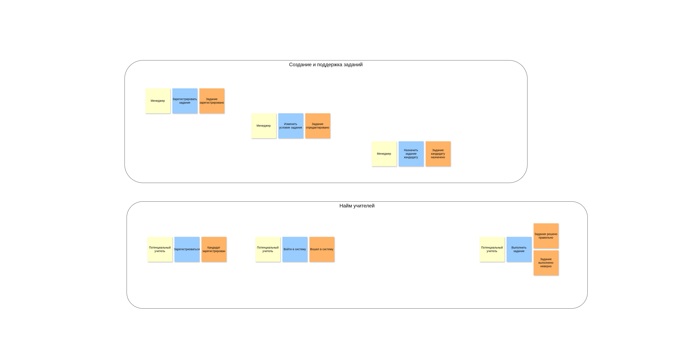
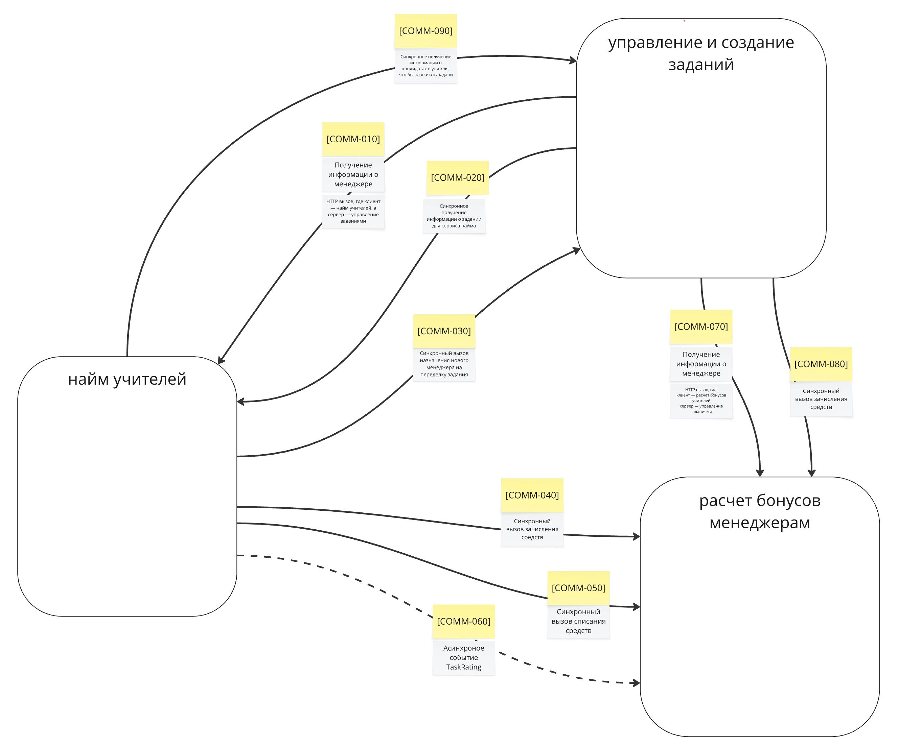

# ADR 1. Избавляемся от strong consistency при передаче информации о Кандидатах в учителя в сервис "Управления заданиями"

## Status

Proposed

## Context

На момент принятия решения система была устроена следующим образом:  

- Кандидаты в учителя регистрировались в системе, и их учетные данные изначально сохранялись в сервисе "Найма учителей".  
- При этом назначение задания для проверки профессиональных качеств кандидатов происходило в сервисе "Управления и создания заданий".  
- С точки зрения system function это можно выразить следующим образом  

  

- С точки зрения system form, бизнес-логика назначения задания кандидату требовала данных о кандидатах в учителя. Подобная формальная связь между сервисами "Найма учителей" и "Управления заданиями", предоставляющая данные о кандидатах в учителя для последующего назначения им заданий, обладала свойством strong consistency и была реализована как синхронный HTTP-вызов, где клиент - сервис "Управления заданиями", а сервер - сервис "Найма учителей" (`[COMM-090]` на диаграмме коммуникаций ниже).

  

- Со временем бизнес вырос, вместе с чем выросло и число кандатов в учителя (но это не точно, возможно, мы забыли удалить все наши тестовые аккаунты, которые остались со времен, когда мы запускали все наши e2e-тесты прямо на против прода). Как бы то ни было, мы теперь highload, тащем-то.
- Ввиду того, как была реализована данная коммуникация между модулями, бизнес столкнулся с рядом проблем:

  - **[Problem-030]** Логика начисления бонусов некорректна из-за ошибки с рейтингом задания. Во время начисления бонусов во время изменения рейтинга, происходит задержка, которая не удовлетворяет бизнес (нужно моментально).
  - **[Problem-040]** Медленно начисляются бонусы менеджерам, потому что много кандидатов в учителя. Иногда вся система падает и не восстанавливается.
  - **[Problem-050]** В UI может отобразиться ошибка каких-то запросов после успешного выполнения задания. Разработчики объясняют это поведение вызовом сервиса оплаты и создания заданий.
  - **[Problem-060]** Нужно сократить расходы на скейлинг сервиса заданий. Сейчас дорого.
  - **[Problem-070]** Менеджерам иногда начисляются бонусы дважды. Это связано с тем, что, когда кандидаты в учителя отправляют то же самое задание повторно, система тупит **[Problem-050]**. Разработчики объясняют тем, что управление заданиями падает, а бонусами — нет. Из-за этого бонусы попадают в два одинаковых запроса.
  - **[Problem-080]** Упавший сервис создания заданий или бонусов кладёт всю систему, и кандидаты в учителя не могут выполнять задания.

Данные проблемы возникли, так как указанная выше синхронная коммуникация (а так же и другие синхронные коммуникациии, но о них вы прочитаете в других ADR) обладает строгой консистентностью (strong consistency) и негативно влияет на характеристики:

- performance
- scalability
- availaibility / fault tolerance
- maintainability
- повышает coupling между сервисами
- неоптимально использует hardware-ресурсы (CPU, RAM)

## Decision

Единственный способ решить проблемы, перечисленные выше, и связанные с низким availability, maintainability, performance - перейти к асинхронному стилю коммуникации в тех местах системы, где это возможно по бизнес-требованиям, и оправдано по смыслу.  

Мы переведем данную коммуникацию на async event-driven подход, в котором будем стримить сущность `Candidate` из сервиса "Найм учителей" в сервис "Управление заданиями".  

- Название события: `CandidateCreated`
- Название топика: `data_replication.candidates`
- Топик будет находиться в Apache Kafka, которая используется для всего проекта (ищите отдельный ADR, как была выбрана Kafka, в директории `integration`, но это уже совсем другая история).

## Consequences

Ожидается, что данное изменение позволит:

- Улучшить availability сервиса "Управления заданиями"
  - Будем мерять SLA по метрикам в графане
- Улучшить scalability
  - Будем следить в графане за CPU / RAM потреблением сервиса, и уменьшим requests/limits для деплоймента, и/или заиспользуем более дешевое железо при той же нагрузке
- Улучшит performance
  - Будем мерять среднее время отлика сервиса на синхронных вызовах к нему / heartbeat
