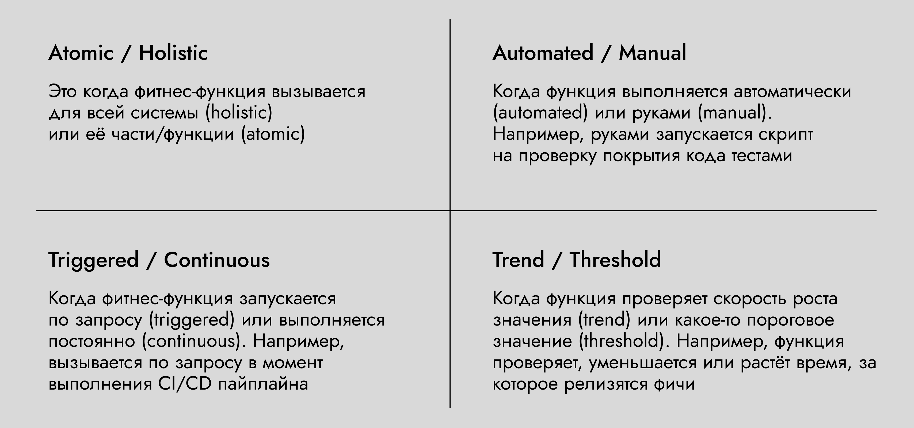

# Домашка 4 недели

## Задание

1. Опишите ADR, который проиллюстрирует причину изменения любой из коммуникаций. Коммуникацию можно выбрать любую из тех, которые вы мигрировали в третьем уроке.

2. Опишите, как почему возникла каждая из 10 проблем, которая возникла у бизнеса и как она будет решаться. Можно заполнить все таблицей

    | Название проблемы | Из-за чего возникла проблема | Как проблема решилась |
    | --------- | ---------------------------------- | ---------------------------------------------- |
    | `[Problem-XXX]` | Связь ХХ оказалась синхронной, хотя должна была быть асинхронной. Из-за этого возникли проблемы с latency … | Перевели синхронный req-res на асинхронный event-driven. Что позволило убрать блокировку в сервисе ХХХ, из-за которой возникала задержка |
    | | | |

3. Опишите все возможные варианты фитнесс функций для Scalability и Reliability характеристик. Достаточно написать один пример фитнесс функции для каждого из вариантов. Список вариантов можно посмотреть в 4.1 уроке:

Можно сделать список в виде:

- Scalability
  - atomic — делаем так
  - holistic — делаем так
  - automated — делаем так
  - manual — делаем так
  - triggered — делаем так
  - continous — делаем так
  - trend — делаем так
  - threshold — делаем так
- Reliability
  - atomic — делаем так
  - holistic — делаем так
  - automated — делаем так
  - manual — делаем так
  - triggered — делаем так
  - continous — делаем так
  - trend — делаем так
  - threshold — делаем так

## Решение

### ADR

[ADR 1. Избавляемся от strong consistency при передаче информации о Кандидатах в учителя в сервис "Управления заданиями"](adr.md)

### Проблемы бизнеса, причины их возникновения, и их решения

| Название проблемы | Из-за чего возникла проблема | Как проблема решилась |
| --------- | ---------------------------------- | ---------------------------------------------- |
| `[Problem-010]` | Связи `[COMM-010]`, `[COMM-030]`, `[COMM-070]`, `[COMM-090]` оказались синхронными, хотя должны быть асинхронными. Связь `[COMM-020]` должна видоизмениться на две - синхронную и асинхронную. Из-за этого возникли проблемы с latency в сервисе "Управления заданиями", повлиявшая на процессы начисления бонусов за создание и выполнение заданий кандидатами | Указанные коммуникации перевели на async event-driven, что позволило разгрузить сервис "Управления заданиями", улучшить scalability, availability, performance |
| `[Problem-020]`, `[Problem-021]` | Данная проблема могла бы возникнуть еще острее, если бы связь `[COMM-020]` была полностью асинхронной. | Для обновления задания необходима связь со strong consistency, чтобы обновлять задание максимально быстро. |
| `[Problem-030]` | Сама по себе задержка могла возникать за счет синхронного вызова нагруженного сервиса. Однако, получение наиболее актуального рейтинга задачи не было "моментальным" - т.к. была использована асинхронная коммуникация с eventual consistency типом. | Для рейтинга заданий - перевели связь `[COMM-060]` на strong consistency, синхронный `GET`-запрос из сервиса "Бонусов" к сервису "Найма", что позволило всегда иметь наиболее актуальный рейтинг задания. |
| `[Problem-040]` `[Problem-050]` `[Problem-060]` | Большое число синхронных вызовов приводило к высокой нагрузке на сервис "Управления заданиями" и как следствие увеличенное время ответа. В итоге казалось что система "тупит", а сам сервис потреблял много ресурсов. Ошибки запросов возникали потому что запросы на выборку новых кандидатов просто падали по таймауту. | Перевели коммуникации `[COMM-010]`, `[COMM-030]`, `[COMM-070]`, `[COMM-090]` на async even-driven, улучшили performance, scalability, availability, latency |
| `[Problem-070]` | Система тупила из-за синхронных коммуникаций, начисления задваивались потому что в сервисе "Бонусов" не была реализована в должном виде идемпотентность. | При переводе на асинхронные коммуникации, реалиовали идемпотентность в консюмере за счет пары значений `event_id` + `produced_at` |
| `[Problem-080]` | Т.к. связи `[COMM-040]`, `[COMM-050]`, `[COMM-080]` были синхронными, это передавало характеристику availability на другие сервисы. В результате падения одного сервиса - недоступно всё. | Данные коммуникации были переведены на async event-driven, бизнес-события `NewTaskPublished`, `TaskCompletedSuccessfully`, `TaskFailed` |
| `[Problem-090]` | Проблема возникала из-за большого числа синхронных связей, и как следствие высокий coupling, когда изменения в одном бизнес-сценарии затрагивали много других сценариев. | Изменение коммуникаций, указанных выше, на асинхронные + применение стратегии тестирования сервисов как "черные ящики" позволило уменьшить вероятность поломки всякого ненужного. |
| `[Problem-100]`, `[Problem-101]` | Данные могли теряться из-за использования асинхронной коммуникации в `[COMM-060]` | Настроили ACK в Кафке, заиспользовали transactional outbox (или не заиспользовали, кто как), настроили retry policy когда брокер недоступен, настроили мониторинг метрик брокера, не забыли про идемпотентность в консьюмерах |

### Фитнес-функции

- Scalability
  - atomic — нагрузочное тестирование отделного сервиса (параллельно зовем сервис / заваливаем событиями из брокера)
  - holistic — нагрузочное тестирование после релиза (если на всю систему то holistic)
  - automated — нагрузочное тестирование по распианию, или по коммиту в gitlab / bitbucket (lol)
  - manual — нагрузочное тестирование после релиза (т.к. запускаем вручную)
  - triggered — нагрузочное тестирование после релиза (т.к. запускаем явно сами)
  - continous — метрики в графане на число Requests Per Minute / Second, хз
  - trend — метрики в графане на число RPM/RPS за период времени
  - threshold — нагрузочное тестирование после релиза (тестируем на минимальные требования)
- Reliability
  - atomic — heartbeat / liveness probe по одному сервису / error rate обработки событий
  - holistic — метрики в графане по всей системе / chaos engineering
  - automated — метрики по error rate HTTP вызовов / обработки событий / размеру DLQ
  - manual — chaos engineering
  - triggered — chaos engineering
  - continous — метрики по error rate HTTP вызовов / обработки событий / размеру DLQ
  - trend — метрики по error rate HTTP вызовов / обработки событий / размеру DLQ
  - threshold — chaos engineering / метрики

### Спасибо что прочитали!

